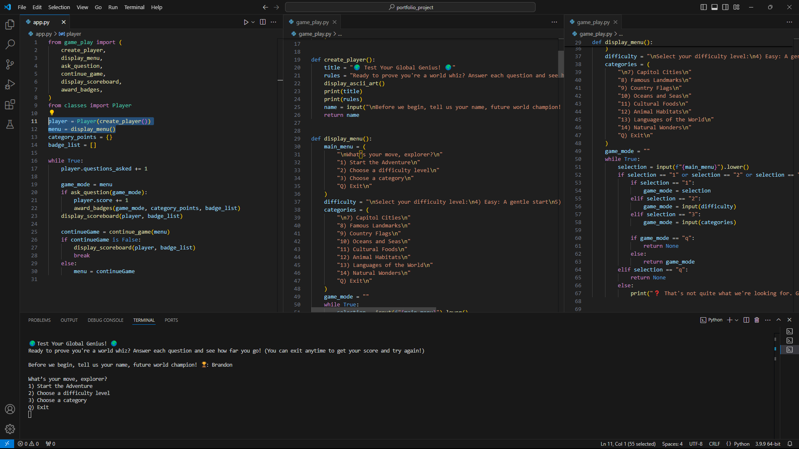
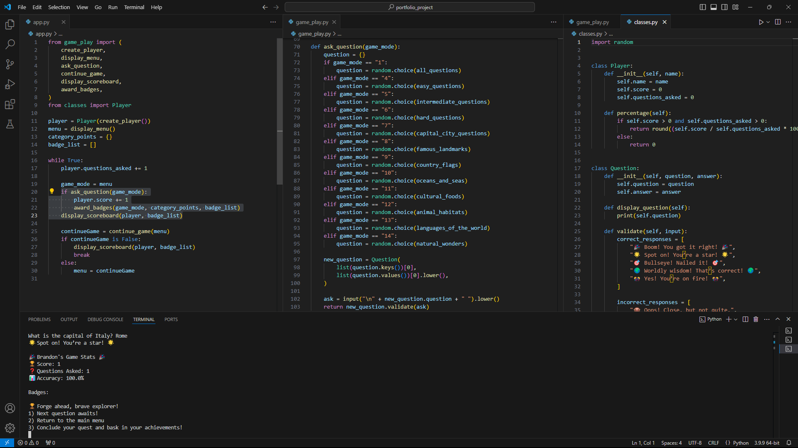
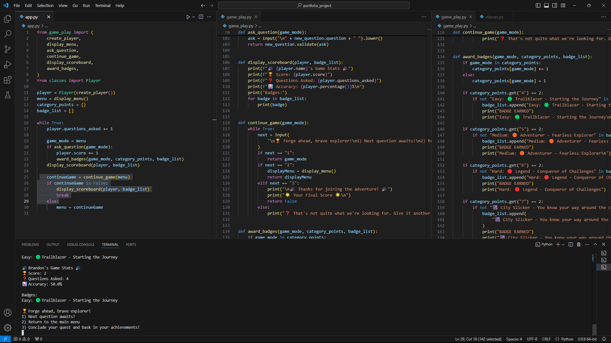
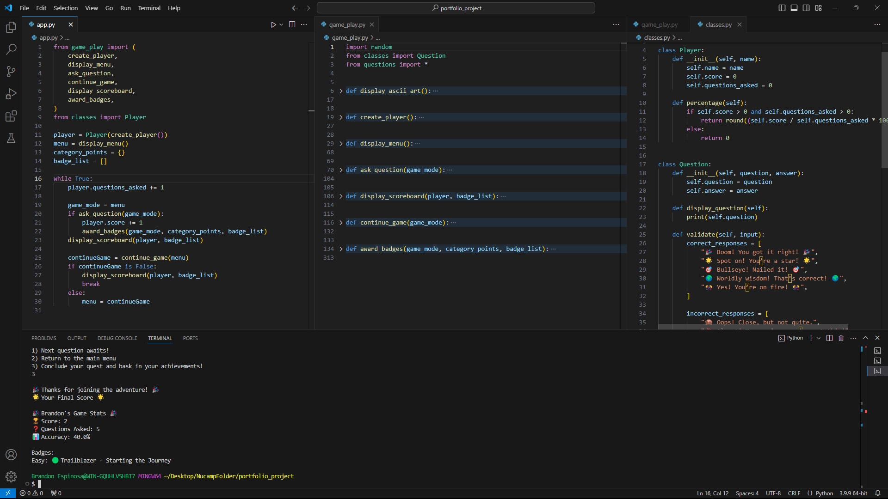

# GlobeMaster

## 🚀 Getting Started
Run the game with:
```bash
python app.py
```

## 🛠️ Tech Stack
- Python 3.x
- Standard Library (no external dependencies)

## Introduction: Design and Implementation
### Design:
The project is a text-based geography trivia game designed to engage users by testing their knowledge of capitals, landmarks, and other geographic trivia. The design focuses on simplicity and replayability. Features include a dynamic scoring system, badges for achievements, and an easy-to-navigate menu. The question bank is categorized into topics like capitals and landmarks, making the game flexible and expandable.

### Implementation
The game is implemented in Python using a modular approach. A list of dictionaries stores questions and answers, and functions handle tasks like question display, answer validation, and score updates. A main game loop drives the gameplay, allowing players to continue or exit after each question. Errors like invalid inputs are handled gracefully. Testing was conducted to ensure case-insensitive answer validation and smooth badge awarding.

## 🖼️ Screenshots

<details>
  <summary>Click to expand</summary>

  ### 🧑‍🎮 Create Player & Display Menu
  

  ### ❓ Create Question, Ask Question & Display Scoreboard
  

  ### 🏅 Continue Game & Award Badge
  

  ### 🏁 Conclusion Screen
  

</details>

## Features
1. Engaging Gameplay:
    * Players are welcomed with a friendly introduction and clear rules, setting an inviting tone.
    * A seamless loop of interactive questions keeps players engaged.

2. Variety of Questions:
    * Includes diverse topics such as countries, capitals, landmarks, and other geographic trivia.
    * Predefined or randomized question sets ensure replayability.

3. User-Friendly Input:
    * Case-insensitive answer validation allows players flexibility in their responses.
    * Explanations for incorrect answers enhance the learning experience.

4. Dynamic Scoring System:
    * Tracks the player’s score and displays it at the end of the game.
    * Encourages progress with congratulatory messages for correct answers.

5. Adaptive Difficulty:
    * The game can adapt to different difficulty levels

6. Simple Navigation:
    * Players can decide whether to continue with the next question or exit the game at any time, ensuring a stress-free experience.
    
7. Detailed End-Game Summary:
    * Displays the final score and stats, including the number of correct and incorrect answers.
    * A personalized thank-you message concludes the game on a positive note.

8. Customizability:
    * Easy to expand with additional categories and questions.
    * Flexible design allows for the addition of features like badges or achievements.

## Shortcomings (additional features)
1. Limited Visual Appeal:
    * As a text-based game, it lacks visual elements that might make it more engaging. In the future, I could incorporate a graphical interface using libraries like tkinter or pygame.
2. Question Pool:
    * The number of questions in each category is limited. Expanding the database or connecting to an API for dynamic content could improve replayability.
3. Error Handling:
    * Although input validation is implemented, some edge cases (e.g., handling unexpected symbols) could be addressed more comprehensively.
4. No Save/Resume Feature:
    * The game does not allow players to save their progress, which could be a valuable addition for longer sessions." 

### Conclusions
From this project, I gained a much deeper understanding of Python, especially using dictionaries, loops, and functions to create dynamic game logic. I improved my problem-solving skills by debugging errors and designing solutions for user input validation and scoring. Planning the project taught me the value of modular code design, making it easier to expand and maintain. Most importantly, this project boosted my confidence in taking an idea and turning it into a functional, user-friendly program. It also reinforced how much I enjoy creating engaging experiences, motivating me to continue learning and exploring game development.